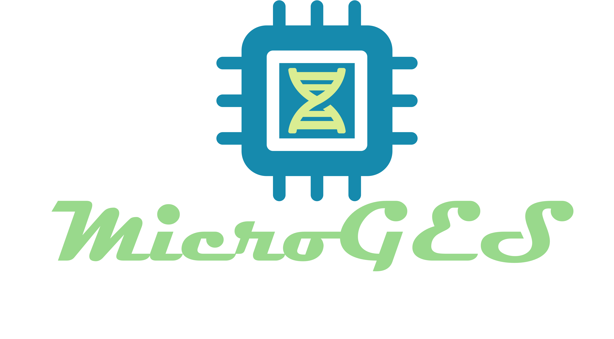

[](LICENSE)

<p align="center"></p>

<p align="center"><b>A solution to identify a gene expression signature in microarray datasets</b></p>


### Documentation

More documentation about the system is available [here](https://github.com/bioinformatics-ua/MicroGES/wiki).

### Team
  * Olga Fajarda<sup id="a1">[1](#f1)</sup>
  * Sara Duarte-Pereira<sup id="a1">[1](#f1)</sup><sup id="a2">,[2](#f2)</sup>
  * João R. Almeida<sup id="a1">[1](#f1)</sup><sup id="a4">,[4](#f4)</sup>
  * Raquel M. Silva<sup id="a3">[3](#f3)</sup>
  * José L. Oliveira<sup id="a1">[1](#f1)</sup>

1. <small id="f1"> Dept. Electronics, Telecommunications and Informatics (DETI / IEETA), University of Aveiro, Aveiro, Portugal </small> [↩](#a1)
2. <small id="f2"> Dept. Medical Science and iBiMED-Institute of Biomedicine, University of Aveiro, Aveiro, Portugal </small> [↩](#a2)
3. <small id="f3"> Faculdade de Medicina Dentária, CIIS-Centro de Investigação Interdisciplinar em Saúde, Universidade Católica Portuguesa, Campus de Viseu, Viseu, Portugal </small> [↩](#a3)
4. <small id="f4"> Dept. of Information and Communications Technologies, University of A Coruña, A Coruña, Spain </small> [↩](#a4)


### Cite

Please cite the following, if you use MicroGES in your work:

```bib
in progress...
```

### Issues
Please let us know if there are any [issues](https://github.com/bioinformatics-ua/MicroGES/issues).

### License
MicroGES is under GPL-3.0 license. For more information, click
[here](https://github.com/bioinformatics-ua/MicroGES/blob/master/LICENSE).
